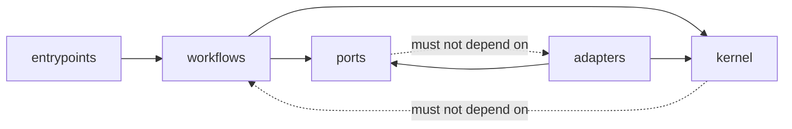
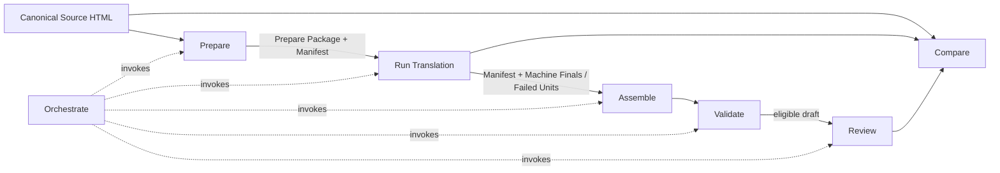
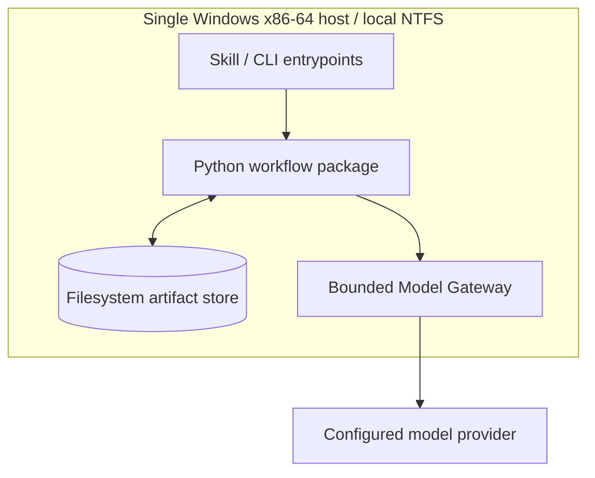

# Architecture Spine — LibrarianLM Literary Translation Workflow Suite

## Design Paradigm

Artifact-centric pipes-and-filters. Each workflow consumes immutable, versioned artifacts and emits new artifacts. The orchestrator sequences filters but owns no domain truth.



## Invariants & Rules

### AD-1 — Artifact-centric pipes-and-filters [ADOPTED]

- **Binds:** all workflows and orchestration
- **Prevents:** hidden shared state and undeclared cross-stage coupling
- **Rule:** Each filter consumes immutable versioned artifacts and emits new artifacts. Filters exchange artifact identities and digests even when co-located. Orchestration may sequence filters but may not define domain truth.

### AD-2 — Shared domain kernel [ADOPTED]

- **Binds:** FR-1–FR-3, FR-5, FR-7, FR-14, FR-20, FR-24, FR-25
- **Prevents:** workflow-local schema forks, incompatible lifecycle vocabularies, and an orchestrator god component
- **Rule:** `kernel/` alone owns cross-workflow schemas, stable identities, lifecycle legality, canonical serialization, and compatibility. Workflows own stage behavior and may not mutate another workflow's output.

### AD-3 — Append-only artifact ledger and atomic snapshots [ADOPTED]

- **Binds:** FR-2, FR-7, FR-15–FR-20, FR-24, NFR-1–NFR-4, NFR-10–NFR-12
- **Prevents:** partial state appearing complete and journal/snapshot divergence
- **Rule:** Content objects and receipts are immutable and digest-addressed. Every manifest carries `previous_manifest_digest`; publication takes that digest as an expected value, locks, rereads the run ref, and compare-and-swaps only on equality. A mismatch yields `manifest-conflict`; the orchestrator deterministically rebases disjoint unit advances in Source Unit order or rejects overlap. The completion receipt binds predecessor and successor digests. Resume trusts only verified receipt chains and referenced digests.

### AD-4 — Locator-derived Source Unit identity [ADOPTED]

- **Binds:** FR-4–FR-7, FR-16–FR-18, FR-24, FR-25, FR-31, SM-1, SM-4
- **Prevents:** duplicate-text collisions, selector drift, fuzzy relocation, and silent source mismatch
- **Rule:** `SourceUnitId` derives from the Canonical Source HTML digest, typed locator, segmentation-profile version, and segment ordinal. A locator is `(owned_root_id, element_child_index_path, text_slot, segment_ordinal)`. Persist neither CSS selectors nor raw XPath. Store the source-text digest separately; any mismatch is terminal.

### AD-5 — Deterministic context wavefronts [ADOPTED]

- **Binds:** FR-8–FR-15, FR-24, FR-29, FR-30, NFR-3, NFR-12
- **Prevents:** runtime scheduling or provider latency changing request context
- **Rule:** Before dispatch, a deterministic kernel function emits a canonical `ContextBundle` per unit: policy digest, role-tagged source/earlier-wave target artifact digests, canonical source-ordinal order, rendered bytes/digest, and an explicit truncation/absence ledger. Peers never consume one another. Required unavailable context yields `blocked`. Model requests and Proposals must reference the exact bundle digest.

### AD-6 — Pure content objects and operational receipts [ADOPTED]

- **Binds:** FR-1, FR-2, FR-7, FR-14, FR-20–FR-25, NFR-2–NFR-4, NFR-11
- **Prevents:** serialization drift, operational timestamps breaking byte equivalence, and implicit schema migration
- **Rule:** Canonical content objects contain artifact type, integer schema version, Run Snapshot digest, producing Skill Workflow identity/version, producer component version, input content digests, payload, and payload digest. They exclude wall-clock time, attempt number, execution ID, and storage path. Invocation receipts carry run and invocation IDs, attempt, times, terminal outcome, findings, and produced digests, and link back to the exact input digests. Migrations are explicit kernel functions; consumers declare accepted versions.

### AD-7 — Python package seed [ADOPTED]

- **Binds:** all `src/i18n-pipeline` implementation
- **Prevents:** multiple language ecosystems, bespoke nested validation, and framework-driven coupling
- **Rule:** Use Python 3.14.4 with Pydantic 2.13.4 boundary models configured `ConfigDict(strict=True, frozen=True, extra='forbid')` under uv 0.11.19. Domain and workflow code remains standard-library-first. The kernel serializer—not Pydantic defaults—owns canonical bytes. The first implementation step creates `pyproject.toml`, resolves and commits `uv.lock`, records its digest in component identity, and proves coercible/unknown inputs fail before feature code proceeds. Introduce no application or web framework.

### AD-8 — Protected-token stream and Inline Binding Map [ADOPTED]

- **Binds:** FR-5, FR-8, FR-12–FR-19, NFR-5, NFR-6, SM-1, SM-4
- **Prevents:** model-authored structure, lost inline context, and nondeterministic reconstruction
- **Rule:** Preparation substitutes source-owned inline boundaries and protected values with exact ASCII tokens formed as `[[[LLM:BIND:` + a 26-character base32 ID + `]]]`; IDs derive from Source Unit identity, binding kind, and source-order ordinal. The separate binding map retains kind, typed locator, source node/attributes, ordinal, optional pair ID, and placement rule. Paired boundaries may move around translated text only within their Source Unit while remaining ordered, properly nested, and non-crossing. Missing, duplicate, invented, cross-unit, or illegal tokens are blocking failures. Assembly rebinds exactly once.

### AD-9 — Independently invocable workflows in one package [ADOPTED]

- **Binds:** FR-1–FR-3, FR-20–FR-25, NFR-2, NFR-10–NFR-12
- **Prevents:** monolithic-only execution, cross-process hidden state, and premature distributed infrastructure
- **Rule:** Prepare, Run, Assemble-and-Validate, Review, Compare, and Orchestrate are thin entrypoints around one importable package. One writer holds a run-scoped lock during publication. Concurrency exists only within a frozen translation wave. MVP has no daemon, queue, service, or database.

### AD-10 — Kernel-enforced orthogonal state machines [ADOPTED]

- **Binds:** FR-1–FR-3, FR-11–FR-15, FR-18–FR-23, NFR-10, NFR-11
- **Prevents:** one success flag implying unrelated quality states and workflow-specific transition semantics
- **Rule:** The kernel validates monotonic per-workflow transitions and separate processing, translation-completeness, deterministic-compliance, human-review, and publication-readiness states. No vector component implies another. Retries append attempts; they never rewrite history.

### AD-11 — Single bounded Model Gateway [ADOPTED]

- **Binds:** FR-3, FR-8–FR-15, FR-29–FR-30, NFR-7–NFR-8
- **Prevents:** direct provider coupling, unbounded context, secret leakage, and calls outside frozen live-run controls
- **Rule:** All live calls cross `ModelGateway`. Preflight verifies artifact compatibility, approved ceilings, and frozen Context Policy bounds. The gateway accepts only canonical `ModelRequest` objects containing exact rendered-input and ContextBundle digests, prompt-template digest, provider plus immutable model revision, all generation/tool parameters, idempotency key, and Translation Method digest. Settings outside the frozen method are rejected. It emits a `GatewayReceipt` binding normalized `ModelResponse` and usage digests to the request; each Proposal references both. Model aliases must resolve to a captured immutable revision before dispatch. Workflows and kernel may not import provider SDKs.

### AD-12 — Prepare owns segmentation and eligibility [ADOPTED]

- **Binds:** FR-4–FR-7, FR-16–FR-19, FR-31, NFR-5, NFR-6
- **Prevents:** stage-local unit boundaries, duplicated projection translation, and assembly disagreement
- **Rule:** Only Prepare classifies content, segments, orders Source Units, issues locators, and defines projection groups. Downstream filters consume the frozen Unit Manifest without resegmentation. A frozen Preparation Policy and versioned deterministic handlers emit Required, Excluded, or Unsupported locations. A supported content class must pass dummy round-trip proof before live use.

### AD-13 — One i18n-owned HTML Document Adapter

- **Binds:** FR-4, FR-5, FR-16–FR-19, NFR-3, NFR-5, NFR-6
- **Prevents:** parser-dependent locators and workflow-local HTML serialization
- **Rule:** After EPUB conversion, all i18n parsing and draft serialization cross the lxml 6.1.2 adapter with network and external entities disabled. The upstream converter's ElementTree/custom-parser boundary is exempt and identified in the Canonical Source Package. The adapter emits typed locators and structural fingerprints, clones before replacement, and permits mutations only to mapped text/tail slots and declared metadata projections. Parser/serializer identity is frozen in the Run Snapshot.

### AD-14 — Assembly and validation are separate filters [ADOPTED]

- **Binds:** FR-16–FR-20, NFR-3, NFR-5, NFR-6, SM-1, SM-4
- **Prevents:** generation owning structure and assembly certifying itself
- **Rule:** Assembly produces a candidate draft from source plus committed Machine Finals. Validation consumes source, manifest, draft, and binding maps read-only and alone determines draft eligibility. Any unresolved blocking finding leaves no eligible Translation Draft.

### AD-15 — Human review is an append-only overlay [ADOPTED]

- **Binds:** FR-21–FR-23, FR-27
- **Prevents:** editorial work erasing machine provenance or deterministic findings
- **Rule:** Human Edits, review states, timing, severity, and book-level findings are separate versioned artifacts keyed by Source Unit or run. Each reviewed export records a per-unit selected-value digest and Projection Map digest, then applies that selected value to every member. Review changes neither Machine Finals nor historical manifests.

### AD-16 — Fixture and live modes share contracts [ADOPTED]

- **Binds:** development-readiness gates, FR-3, FR-17, FR-29–FR-30
- **Prevents:** deterministic tests making live calls and live execution bypassing gates
- **Rule:** Fixture mode cannot resolve a live Model Gateway and emits only typed structural fixtures. Live mode requires a verified signed Prepare Package and confirmation receipt whose Preparation Policy, Translation Method, and Context Policy digests match. Mode is explicit in receipts and never inferred from credentials.

### AD-17 — Canonical Source Package boundary

- **Binds:** FR-4, FR-5, FR-16–FR-19, FR-31, NFR-5, NFR-6
- **Prevents:** translating reader chrome, silently losing upstream-omitted book content, and treating duplicated reader projections as independent source
- **Rule:** Prepare accepts a Canonical Source Package: immutable HTML bytes/digest, EPUB converter identity/version, converter summary/digest, and ownership/projection profile version. For the current reader, the chapters slot and canonical title/author metadata are book-owned; controls, CSS, JavaScript, generated facts, and template chrome are not. Title/navigation duplicates are projections keyed to one Source Unit. Any non-zero converter omission affecting book-owned input blocks preparation until the upstream converter preserves it or the content class is explicitly unsupported; aggregate omission counts cannot authorize silent exclusion.

### AD-18 — Signed preparation and explicit confirmation

- **Binds:** FR-3, FR-7, FR-29–FR-31
- **Prevents:** live execution from relying on an unverifiable or stale operator confirmation
- **Rule:** Prepare emits an HMAC-SHA-256 signature over the canonical package digest through `PackageSigner`. The trusted runtime owns an ACL-protected key ring outside artifacts; signatures carry key ID and scheme version. New runs use the one active key; prior non-revoked keys remain verify-only for historical runs; revoked or unknown keys, unavailable verification, and signature mismatch fail closed. A separate confirmation receipt records operator identity, confirmation time, exact package digest, and key ID. The kernel validates that the Preparation Policy is compatible and contains explicit content dispositions and versioned detector tolerances, and that the Translation Method and Context Policy are internally complete.

### AD-19 — Validation controls and machine-truth reports

- **Binds:** FR-18–FR-20, FR-31, NFR-5, NFR-6, SM-1, SM-4
- **Prevents:** structurally valid output bypassing language/accessibility checks and required reports existing only as disposable views
- **Rule:** Validation composes structural, locked-terminology, residual-language, locale/directionality, and accessibility controls under the frozen Preparation Policy. The residual detector is a versioned port returning evidence, exemptions, tolerances, and declared false-positive/false-negative limits. Assembly projects canonical BCP 47 `lang`, computed root `dir`, nested passage languages, and one translated value to every declared title/navigation projection. `AssemblyReport`, `ValidationReport`, and `TranslationRunSummary` are canonical content objects containing eligibility counts/reasons, findings, limitations, and status-vector values; HTML/Markdown files are projections only.

### AD-20 — Reproducible pilot-evidence contract [ADOPTED]

- **Binds:** FR-22, FR-23, FR-25, FR-27, SM-3, SM-5, SM-6
- **Prevents:** usefulness claims being computed from incomparable tasks or undocumented editor procedures
- **Rule:** Baseline Method and Editor Evaluation Protocol are frozen content objects. Review records protocol-keyed clocks, edits, severities, and assignment metadata; Compare produces a `UsefulnessEvaluationReport` only after equivalence checks. The report carries editor count, assignment/blinding, exclusions, uncertainty, critical residual errors, gold-subset results, sample-size rationale, analysis plan identity, recovery yield, and edit-burden metrics.

### AD-21 — Editorial applicability and candidate eligibility [ADOPTED]

- **Binds:** FR-6, FR-8, FR-10–FR-15, SM-2
- **Prevents:** unscoped editorial guidance, Literal Anchors becoming finals, and unevaluated text being committed
- **Rule:** Confirmed Terminology and Literary Style Sheets are frozen Run Snapshot inputs whose rules resolve during Prepare to explicit Source Unit ID sets. Candidate kind is one of `literal-anchor`, `idiomatic`, or `recovery`; Literal Anchors are evaluator references only and never enter routing, recovery, or commitment eligibility. `MachineFinal` may reference only an idiomatic or recovery candidate whose exact digest passed the required evaluation and Hard Rules, and must retain evaluation digest plus selection rationale.

### AD-22 — Single-host live operational envelope

- **Binds:** AD-3, AD-9, AD-11, AD-18, NFR-2, NFR-7–NFR-8, NFR-10–NFR-12
- **Prevents:** relying on incompatible filesystem locking/atomicity, ambiguous credential custody, and unsafe crash recovery
- **Rule:** MVP live mode runs on one Windows x86-64 host with an operator-owned local NTFS artifact root; synchronized, removable, and network filesystems are unsupported. Startup contract tests must prove same-volume atomic replace, exclusive run locking, writable durable flush, exact locked dependencies, and HTML serialization fixture digest. The operator account alone has artifact/key permissions. Secrets are resolved from versioned runtime secret references only and never enter artifacts or logs; credential rotation changes the resolved version for a new invocation and is recorded by reference in its Gateway Receipt without changing run truth. A lock may be reclaimed only after local process-liveness verification; recovery proceeds from the last verified receipt/manifest chain. MVP performs no automatic pruning or garbage collection: the complete object, receipt, ref, and verify-key history remains intact. An operator backup is taken only while all run locks are quiescent; restore targets an empty local NTFS root and must pass full object-digest, reference-reachability, receipt-chain, and signature verification before resume. Other hosts/filesystems block live mode until their adapter contract passes and their environment identity is frozen.

### AD-23 — Durable live-invocation protocol

- **Binds:** FR-3, FR-8–FR-15, FR-24, FR-29, NFR-2, NFR-10–NFR-12
- **Prevents:** crash recovery duplicating model calls, disagreeing on budget use, or committing orphan responses
- **Rule:** A logical invocation advances through immutable receipt states `reserved → dispatched → provider-acknowledged → terminal`, each linking its predecessor. The kernel durably publishes `reserved` before transfer; logical invocation ID, attempt, canonical request digest, and idempotency key are fixed. Resume reuses the key only when the adapter proves idempotency or queryable provider status. A crash after `dispatched` with unknown non-idempotent status yields `reconciliation-required` and cannot auto-retry. Dispatched attempts count against frozen ceilings; only a terminal receipt may link a response into a manifest successor.

## Consistency Conventions

| Concern | Convention |
| --- | --- |
| Python names | Packages/modules/functions use `snake_case`; types use `PascalCase`; constants and terminal-state wire values use `UPPER_SNAKE_CASE` and `lower-kebab-case` respectively. |
| Identities and digests | Persist lowercase SHA-256 hex. Domain IDs are typed strings prefixed by kind and derived from canonical identity material; never use paths, database keys, or random IDs as cross-workflow identity. |
| Canonical JSON | UTF-8, LF, sorted object keys, compact separators, integer schema versions, integers for counts/budgets, decimal strings for non-integral scores, and explicit RFC 3339 UTC strings only in receipts. Reject floats, NaN, duplicate keys, unknown fields, and implicit coercion. |
| Errors and findings | Stable code plus workflow, artifact/Source Unit, rule, expected, observed, retryability, and next operator action. Exceptions do not cross entrypoint boundaries. Validation severities are `blocking-error` or `warning`. |
| Configuration | Product-affecting configuration is frozen and digest-addressed. Environment variables may identify artifact roots and secret references only; they may not alter a confirmed run's profile, method, context, or bounds. |
| Logging | Operator logs reference identities and digests. Invocation receipts are machine truth for timing, attempts, outcomes, and findings. |
| Comparison | Equivalent runs require matching Canonical Source HTML, Target Locale, terminology, style, Pilot Profile, and compatible method/context identities; otherwise comparison reports `non-equivalent`. |

## Kernel Contract Seed

| Contract | Required machine-truth shape |
| --- | --- |
| `UnitManifest` | Source Package and Run Snapshot digests; segmentation/profile identities; ordered `UnitRecord` values; projection groups; current status vector; provenance object references. |
| `UnitRecord` | Source Unit ID and ordinal; typed locator; source digest; content class; `required`, `excluded`, or `unsupported` eligibility with reason; projection group; Inline Binding Map digest; lifecycle state; proposal/evaluation/recovery/final/failure references. |
| Required-unit lifecycle | `prepared → proposed → evaluated → committed`; recovery branch `evaluated → recovery-pending → recovery-proposed → recovery-evaluated → committed`; any eligible nonterminal may enter `failed` only with a typed exhausted/terminal finding. `committed` and `failed` are terminal. |
| `InlineBindingMap` | Source Unit/source digests; token entries containing token ID, kind, source-order ordinal, typed locator, source node/attributes, optional pair ID, placement rule; map digest. |
| `ContextBundle` | Source Unit and policy digests; role-tagged source/target artifact references in canonical source order; exact rendered fragments; token budget; truncation/absence decisions; rendered-byte digest. |
| `ProjectionMap` | Group ID; canonical Source Unit; member typed locators; ownership; cardinality; escaping/transformation rule. Draft and reviewed export record the selected-value and map digests applied to every member. |
| `ModelRequest` / `ModelResponse` | Exact rendered inputs, ContextBundle/prompt/method digests, immutable provider/model revision, all parameters/tools, idempotency key; normalized response, usage, finish reason, provider request ID, and request-bound Gateway Receipt digest. |
| Provenance object registry | `Proposal`, `Evaluation`, `RecoveryCandidate`, `MachineFinal`, `FailedUnit`, `HumanEditSet`, and book finding objects are separately addressable content objects; the manifest references them by type and digest rather than embedding mutable histories. |
| Required reports | `AssemblyReport`, `ValidationReport`, `TranslationRunSummary`, `RunComparison`, and `UsefulnessEvaluationReport` are canonical content objects. Human-readable views render these objects and carry no independent state. |
| Component identity | Python implementation/version, platform/ABI, uv lock digest, package versions, lxml version, native `LIBXML_VERSION`/`LIBXSLT_VERSION`, and deterministic HTML serialization fixture digest; startup rejects drift in live mode. |

## Stack

| Name | Version |
| --- | --- |
| Python | 3.14.4 |
| Pydantic | 2.13.4 |
| lxml | 6.1.2 |
| uv | 0.11.19 |

These verified-current seed pins become enforceable only when the mandatory first implementation step commits `pyproject.toml` and its generated `uv.lock`; live mode also verifies Component Identity at startup.

## Structural Seed

```text
src/i18n-pipeline/
  pyproject.toml
  uv.lock
  src/librarianlm_i18n/
    kernel/              # contracts, identities, states, canonical JSON
    workflows/           # prepare, run, assemble_validate, review, compare, orchestrate
    ports/               # artifact store, HTML, model, signer, detector, clock
    adapters/            # filesystem, lxml, provider SDKs, runtime signer, detectors
    entrypoints/         # independently invocable Skill/CLI adapters
  tests/
    contracts/           # schema, transition, canonical-byte, and adapter contract tests
    fixtures/            # synthetic/public-domain deterministic corpus
    integration/         # end-to-end fixture and gated live tests
```





```text
artifact-root/
  objects/sha256/{digest}.json       # all immutable contracts, provenance, and reports
  runs/{run-id}/receipts/{id}.json   # immutable operational receipts
  runs/{run-id}/refs/manifest.json   # atomically replaced pointer to manifest digest
  runs/{run-id}/views/               # disposable HTML/Markdown projections
  locks/{run-id}.lock                # single-writer publication lock
```

## Capability → Architecture Map

| Capability / Area | Lives in | Governed by |
| --- | --- | --- |
| Skill contracts and orchestration (FR-1–FR-3) | `entrypoints/`, `workflows/orchestrate` | AD-1, AD-2, AD-6, AD-9, AD-10 |
| Preparation and frozen inputs (FR-4–FR-7, FR-31) | `workflows/prepare`, `kernel/`, HTML/signer adapters | AD-3, AD-4, AD-8, AD-11–AD-13, AD-16–AD-18, AD-21, AD-22 |
| Generation, evaluation, routing, recovery, commitment (FR-8–FR-15, FR-29, FR-30) | `workflows/run`, Model Gateway | AD-5, AD-8, AD-10, AD-11, AD-16, AD-21–AD-23 |
| Assembly and validation (FR-16–FR-20) | `workflows/assemble_validate`, HTML/detector adapters | AD-4, AD-8, AD-12–AD-14, AD-17, AD-19 |
| Review (FR-21–FR-23, FR-27) | `workflows/review`, artifact projections | AD-6, AD-10, AD-15, AD-20 |
| Reproduction, comparison, and pilot evidence (FR-24, FR-25, FR-27) | `workflows/compare`, artifact store | AD-3, AD-4, AD-6, AD-20, comparison convention |
| Integrity, accessibility, operability (NFR-1–NFR-12) | kernel, ports, contract tests | AD-3–AD-6, AD-8–AD-23 |

## Deferred

- **Pilot values:** representative public-domain corpus and qualification budgets wait for the approved Pilot Profile; they block comparative usefulness claims and release qualification, not generic live translation or review.
- **Translation Method values:** prompts, provider/model choice, evaluator scales, gates, recovery recipe, and retry/token/time/cost ceilings wait for Product and Editorial approval; generic workflow code must not hard-code them.
- **Language-specific segmentation and detection heuristics:** implementations live behind versioned Prepare handlers/detector ports and become supported only after corpus tests, declared error limitations, and dummy round-trip proof.
- **Safe composition:** disabled until a later Translation Method defines and evaluates the complete composed result.
- **Dedicated review UI and multi-editor collaboration:** revisit after artifact-first review demonstrates the pilot workflow and UX requirements exist.
- **EPUB/XLIFF export and public publishing:** revisit after the HTML pilot meets SM-1–SM-4.
- **Automated book-level continuity audit:** revisit after pilot error analysis; unit evaluation does not certify it.
- **Database, queues, services, and distributed workers:** revisit only when frozen Pilot Profile budgets cannot be met by one-package, run-locked execution.
