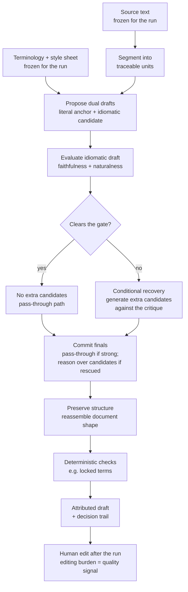

# The Translation Principle

The reasoning behind a staged, inspectable literary-translation method — not a build specification.

This document is about *why* translation should behave as propose → evaluate → recover → commit rather than a single generative call. Thresholds, providers, schemas, storage, and packaging are project choices. The stance below is what those choices are trying to serve, and it is meant to travel.

---

## Flow



Per unit, the same idea in compressed form:

```text
source unit
    │
    ▼
┌───────────────────────────────┐
│ Propose                       │
│   literal  (anchor, never final)
│   idiomatic (selectable draft)│
└───────────────┬───────────────┘
                ▼
┌───────────────────────────────┐
│ Evaluate + route              │
│   faithfulness / naturalness  │
│   scores = routing, not approval
└───────────────┬───────────────┘
                │
        ┌───────┴───────┐
        ▼               ▼
   gate pass       gate fail
   (no extras)     (rescue candidates)
        │               │
        └───────┬───────┘
                ▼
┌───────────────────────────────┐
│ Commit                        │
│   pass-through if strong      │
│   deliberate if rescued       │
│   rationale always retained   │
└───────────────────────────────┘
```

---

## The problem we refuse to paper over

Fluent machine translation is easy to get and hard to trust. A polished paragraph can still omit a clause, invent a detail, drift a recurring term, flatten a verse line, or move emphasis to the wrong word. In ordinary product localization those failures are annoying. In literary work they are decisive: structure, voice, imagery, and continuity *are* the text.

So the method is not optimized for “sounding done.” It is optimized for producing an editorial starting point that a human can read, distrust productively, and correct — without having to reverse-engineer what the model silently changed.

The working hypothesis is simple: an automatic pipeline can produce a *useful* draft of a literary translation if it preserves structure, keeps unit-level provenance, and treats post-run human editing effort as the honest quality signal. Model self-scores are never that signal.

---

## Translation as staged judgment, not one answer

A single model response collapses three different jobs into one opaque act: inventing wording, checking that wording, and committing to a final. When those jobs fuse, errors become hard to see and harder to improve.

The principle separates them:

1. **Propose** — generate candidate renderings of each traceable unit of source.
2. **Evaluate and route** — judge those candidates for meaning and native fluency, and decide whether more work is warranted.
3. **Commit** — choose or compose the final for each unit, with a reason, under a discipline that respects what already passed.

The trajectory is fixed on purpose. The model does not invent the workflow; the workflow invents the conditions under which the model is useful. That keeps the method comparable across runs, and revisable without turning every surrounding product surface into a new experiment whenever the method evolves.

---

## Two renderings before one judgment

Every unit begins with a dual draft:

- A **literal** rendering — formal equivalence: as close as possible to source wording and order, even if it sounds stiff. This is a faithfulness *anchor*, not a candidate for publication voice.
- An **idiomatic** rendering — dynamic equivalence: the same information, register, and tone in natural target-language prose, refusing calque and translationese.

The literal is never selected as the final. Its job is to give the evaluator a mirror: when the idiomatic draft drifts, invents, or softens meaning, the literal makes the drift visible. Without that contrast, “sounds good” too easily substitutes for “means the same thing.”

This is the literary stance in miniature: meaning and naturalness are both required, and they pull in different directions. The method holds both in view instead of hoping one fluent pass will balance them.

---

## Scores route effort; they do not certify literature

When the evaluator scores a unit, it is answering an operational question: *is this idiomatic draft good enough to carry forward, or should we generate more alternatives?* Faithfulness and naturalness are the axes because they catch the two most common silent failures — wrong meaning and translationese that masquerades as style.

Those scores are **routing telemetry**. They decide whether extra candidates are worth generating. They do not mean the translation is publishable, coherent as a whole book, or free of voice damage across a longer span. Treating them as literary approval would bake self-evaluation bias into the product.

The honest quality signal arrives later: how much a qualified human must change, how long that takes, and whether severity-critical errors survive the edit pass. The machine’s job is to lower that burden while remaining inspectable when it fails.

---

## Spend recovery where the draft is weak

Weak units get a second chance — additional candidates generated because the first idiomatic attempt failed the gate, or because a hard terminology rule was violated. Strong units do not: inventing alternatives for text that already passed wastes attention and invites needless rewriting.

Rescue is therefore conditional and local. It is not a second full translation of the work. Effort concentrates where the first pass confessed weakness. That keeps the method economical in spirit even when the work is long: most units should pass through; only the contested ones expand the candidate set.

When recovery fires, the extra candidates should answer the critique, not merely re-roll the dice. Typical useful diversity:

- another literal for a fresh faithfulness check;
- another idiomatic meaning-by-meaning rendering;
- a freer rendering unconstrained by method, still bound to source meaning.

The point is breadth where judgment found a defect — not more of the same failure mode.

---

## Pass-through is a literary discipline

When a unit has already cleared the gate, assembly’s default is to leave it alone. The assembler may correct an outright error or an obvious calque; it must not rewrite good units for taste.

Taste belongs to the human editor after the run. If the machine “improves” every passing sentence, provenance becomes fiction and editing burden becomes noise — you can no longer tell what the method produced versus what a second generative pass preferred.

For rescued units, assembly *does* reason: it weighs the full candidate set against the critique that triggered recovery, and may compose rather than merely pick. The difference in effort is intentional. Gate-passing text is trusted enough to pass through; contested text earns deliberation.

---

## Provenance is part of the translation

A useful draft without a trail is only half useful. For each unit the method retains enough history to answer: what was proposed, how it was scored, whether recovery fired, what was chosen, and why.

That trail is not engineering garnish. It is how you learn the method’s failure modes, how runs stay comparable when configuration changes, and how review distinguishes immutable machine output from later human edits. If the final text cannot be located back to its decisions, the pipeline has produced a black box with nicer prose — the failure mode we started by rejecting.

Rationale and telemetry travel beside the text, never inside it. Finals that contain pipeline labels, score chatter, or untranslated source leakage have failed the method even if they “read fine.”

---

## Structure and language are different kinds of truth

Literary source is not a bag of sentences. Block identity, order, inline emphasis, verse lines, footnotes, and similar scaffolding carry meaning that fluent paragraph text can destroy without looking “wrong.”

So the principle treats **visible language** as what models translate, and **structure** as what must survive intact. Markup and skeleton are not stylistic suggestions; they are constraints. Emphasis and similar marks may land where the target sentence needs them, because placement itself can be a translation decision — but structural tokens are not allowed to vanish, invent, or leave the document looking complete while silently broken.

Terminology follows the same honesty: some renderings are governed, not hoped for.

- **Locked** — mandatory form; checkable without asking the model whether it complied.
- **Preferred** — default rendering that may yield to clear literary context.
- **Guidance** — preserve a meaning or stylistic effect rather than fixed wording.

Operational success (“the run finished”) and compliance (“the hard rules held”) stay distinct so a polished result cannot hide a violated term behind high scores.

---

## Freeze the question so the answer can be judged

A translation run answers a fixed question: this frozen source, this frozen terminology and style sheet, this frozen method configuration. Live source must not rewrite the question mid-flight. Reproducibility is what makes editing burden and rescue rate meaningful across attempts.

Language-specific literary knowledge belongs in that frozen sheet and configuration — tense, address forms, register, recurring imagery — not as folklore hard-coded into the orchestration. The method should stay parameterized so the *stance* transfers when the target language or sheet changes.

---

## Automatic through the run; human after it

Once a run starts, the pipeline completes without intermediate human gates. Segmentation, proposal, evaluation, recovery, assembly, and compliance checking proceed as one automatic trajectory. Human involvement begins when there is something to read and edit.

That is not a claim that machines replace literary judgment. It is a claim about *when* judgment is most valuable: after a complete, attributable draft exists — not as a series of mid-pipeline taste checks that make the method irreproducible and the cost unbounded.

---

## The method may change; the principle should not

The scored propose → evaluate → recover → commit shape is one embodiment of this thinking. Other methods may replace it. What must remain stable is the honesty contract:

- no fluent opacity that conceals omission or structural damage;
- no confusing routing scores with literary approval;
- no silent rewrite of text that already earned pass-through;
- no final without attributable history;
- no invented success or compliance-clean claim when evidence is missing or residual findings remain.

Surrounding product surfaces should depend on that honesty envelope, not on the internal stage names of today’s method. The translation core stays revisable for experiments precisely so the principle can be tested rather than fossilized into one prompt set.

---

## In one sentence

Hold meaning and naturalness in productive tension, spend recovery only where the draft fails, leave good text alone, keep every decision inspectable, preserve structure as strictly as prose, and measure usefulness by how little a careful human must still do — never by how confidently the model scored itself.
